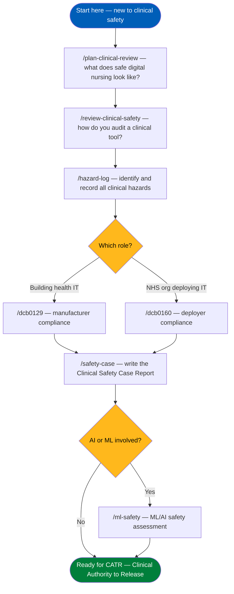

# NHS Clinical Safety Skills for Claude Code

> **An open educational resource for student nurses, newly qualified nurses, and aspiring Digital Clinical Safety Officers**

[](LICENSE)
[](ATTRIBUTION.md)
[](https://digital.nhs.uk/services/clinical-safety/documentation)
[](https://www.nmc.org.uk/standards/standards-for-nurses/)
[](skills/)
[](CONTRIBUTING.md)

---

## What Is This?

This is a collection of **Claude Code skills** — AI-assisted learning guides — that help you understand and apply **NHS England's clinical safety standards** for health IT systems.

If you are a:
- **Student nurse** studying digital health or patient safety
- **Newly qualified nurse** stepping into a Digital Clinical Safety Officer (DCSO) role
- **Health IT developer** trying to understand what DCSOs need from you
- **Nurse educator** teaching digital clinical safety

...these tools are for you.

> **These are educational tools, not official guidance.** Always refer to the original [NHS England Clinical Safety Standards](https://digital.nhs.uk/services/clinical-safety/documentation) for formal compliance work. See [DISCLAIMER.md](DISCLAIMER.md).

---

## Why Clinical Safety Matters for Nurses

When health IT systems go wrong, patients are harmed. In the UK, **DCB0129** and **DCB0160** are the mandatory NHS England standards that govern how health IT systems must be made and deployed safely.

Increasingly, **nurses are being asked to act as Digital Clinical Safety Officers (DCSOs)** — the clinically qualified professionals who sign off that a system is safe before it reaches patients. This is a significant responsibility that requires understanding a complex regulatory framework.

This resource breaks that framework into structured, AI-assisted learning tools so you can:

- Understand what a hazard log is and how to build one
- Know the difference between DCB0129 (for software manufacturers) and DCB0160 (for NHS organisations that deploy software)
- Learn how to write a Clinical Safety Case Report
- Understand what makes AI/ML in clinical settings uniquely risky
- Apply the NMC Standards of Proficiency (2018) to digital health tools

---

## The 11 Skills

### Learning Path for Student Nurses



---

### All Skills at a Glance

#### Clinical Safety Standards (DCB0129/DCB0160)

| Skill | Purpose | Best For |
|-------|---------|---------|
| [`/dcb0129`](skills/dcb0129/SKILL.md) | DCB0129 manufacturer compliance walkthrough | Developers, DCSOs for manufacturers |
| [`/dcb0160`](skills/dcb0160/SKILL.md) | DCB0160 deployer compliance walkthrough | NHS organisations, DCSOs for deployers |
| [`/hazard-log`](skills/hazard-log/SKILL.md) | FMEA-based hazard log creator | All DCSOs, clinical safety students |
| [`/safety-case`](skills/safety-case/SKILL.md) | Clinical Safety Case Report writer | DCSOs preparing for CATR |
| [`/crm-plan`](skills/crm-plan/SKILL.md) | Clinical Risk Management Plan creator | DCSOs setting up new programmes |
| [`/ml-safety`](skills/ml-safety/SKILL.md) | ML/AI health IT safety assessment | DCSOs reviewing AI tools |

#### Clinical Product Review

| Skill | Purpose | Best For |
|-------|---------|---------|
| [`/plan-clinical-review`](skills/plan-clinical-review/SKILL.md) | UK nursing product direction review | Nurses reviewing any digital tool |
| [`/review-clinical-safety`](skills/review-clinical-safety/SKILL.md) | DCB0129/DCB0160 code safety audit | DCSOs reviewing health IT code |

#### For CQAI Tool Builders

| Skill | Purpose |
|-------|---------|
| [`/qa-streamlit`](skills/qa-streamlit/SKILL.md) | QA testing for Streamlit + Hugging Face Spaces |
| [`/ship-hf`](skills/ship-hf/SKILL.md) | Ship to GitHub + Hugging Face Spaces |
| [`/review-fhir`](skills/review-fhir/SKILL.md) | FHIR R4 UK compliance audit (UKCore, SNOMED UK, dm+d) |

---

## Key Concepts Covered

### DCB0129 — What Manufacturers Must Do

If you or your organisation **makes or significantly modifies** a health IT system used in NHS care, DCB0129 applies. The `/dcb0129` skill walks you through:

- Nominating a clinically qualified DCSO
- Building a Clinical Risk Management System (CRMS)
- Identifying clinical hazards (using FMEA and structured prompts)
- Classifying risks using the NHS Severity × Likelihood matrix
- Implementing risk controls (design → protective → informational → procedural)
- Writing a Clinical Safety Case Report (CSCR)
- Preparing for Clinical Authority to Release (CATR)

### DCB0160 — What Deployers Must Do

If your NHS organisation **deploys and uses** a health IT system, DCB0160 applies — even if you didn't build it. The `/dcb0160` skill covers:

- Local hazard identification (separate from the manufacturer's assessment)
- Reviewing the manufacturer's DCB0129 safety case
- Staff training and competency requirements
- Downtime procedures and fallback planning
- Deployment Safety Case requirements

### The NHS Risk Matrix

Both standards use the same 5×5 risk matrix:

| | Negligible | Minor | Considerable | Major | Catastrophic |
|---|:---:|:---:|:---:|:---:|:---:|
| **Very High** | 5 | 10 | **15** | **20** | **25** |
| **High** | 4 | 8 | 12 | **16** | **20** |
| **Medium** | 3 | 6 | 9 | 12 | **15** |
| **Low** | 2 | 4 | 6 | 8 | 10 |
| **Very Low** | 1 | 2 | 3 | 4 | 5 |

🟢 **1–5**: Acceptable — document, no action needed
🟡 **6–12**: Tolerable — controls must be implemented
🔴 **15–25**: Unacceptable — must be eliminated before release

### NMC Proficiency Alignment

The `/plan-clinical-review` skill maps every tool against the **NMC Standards of Proficiency for Registered Nurses (2018)** — all 7 Platforms — to ensure digital tools genuinely support nursing education and safe practice.

---

## Install

### Requirements

- [Claude Code](https://claude.ai/claude-code) CLI installed
- macOS, Linux, or Windows (WSL)

### Install All Skills

```bash
git clone https://github.com/Clinical-Quality-Artifical-Intelligence/nhs-clinical-safety-skills
cd nhs-clinical-safety-skills
./install.sh
```

Restart Claude Code. All skills are available as `/skill-name` commands.

### Install a Single Skill

```bash
cp skills/hazard-log/SKILL.md ~/.claude/commands/hazard-log.md
```

### Verify Install

In Claude Code, type `/hazard-log` — you should see the skill activate.

---

## Usage Examples

### "I need to start a hazard log for a new nursing app"

```
/hazard-log
```

The skill will ask you about your system, then walk you through all 7 hazard
categories with structured prompts, producing a completed hazard log table.

### "I'm a student nurse and want to understand what a DCSO does"

```
/dcb0129
```

Start with Step 1 — the skill will explain the DCSO role, scope assessment,
and why clinical safety matters for health IT.

### "I need to review whether this Streamlit nursing tool is clinically safe"

```
/review-clinical-safety
```

The skill runs a structured DCB0129 checklist across the codebase and produces
a hazard register with required mitigations and a release recommendation.

### "Our trust is deploying a new EPR — what do we need to do for DCB0160?"

```
/dcb0160
```

The skill guides you through deployment-specific hazard identification, reviewing
the manufacturer's safety case, go-live criteria, and post-deployment monitoring.

---

## Recommended Workflow

For building and releasing a clinical tool safely:

```
Stage 1 — Planning
  /plan-clinical-review     Is this the right thing to build for nurses?

Stage 2 — Building
  [build your tool]

Stage 3 — Safety Review
  /review-clinical-safety   Clinical safety code audit (every release)
  /hazard-log               Document all identified hazards

Stage 4 — Compliance (for formal DCB compliance)
  /dcb0129 or /dcb0160      Full compliance walkthrough
  /crm-plan                 Clinical Risk Management Plan
  /safety-case              Clinical Safety Case Report

Stage 5 — Specialist Reviews
  /ml-safety                If your tool uses AI/ML
  /review-fhir              If your tool uses FHIR

Stage 6 — QA and Release
  /qa-streamlit             Test the Streamlit app
  /ship-hf                  Ship to GitHub + Hugging Face Spaces
```

---

## Standards and Sources

These skills are informed by (but do not reproduce) the following standards. Always consult the original sources for formal compliance:

| Source | What it covers |
|--------|---------------|
| [DCB0129](https://digital.nhs.uk/data-and-information/information-standards/information-standards-and-data-collections-including-extractions/publications-and-notifications/standards-and-collections/dcb0129-clinical-risk-management-its-application-in-the-manufacture-of-health-it-systems) | Clinical safety for health IT manufacturers |
| [DCB0160](https://digital.nhs.uk/data-and-information/information-standards/information-standards-and-data-collections-including-extractions/publications-and-notifications/standards-and-collections/dcb0160-clinical-risk-management-its-application-in-the-deployment-and-use-of-health-it-systems) | Clinical safety for health IT deployers |
| [NHS Clinical Safety Documentation](https://digital.nhs.uk/services/clinical-safety/documentation) | Templates, hazard log, guidance |
| [NMC Standards (2018)](https://www.nmc.org.uk/standards/standards-for-nurses/standards-of-proficiency-for-registered-nurses/) | Nursing proficiency platforms 1–7 |
| [NICE Evidence Standards Framework](https://www.nice.org.uk/about/what-we-do/our-programmes/evidence-standards-framework-for-digital-health-technologies) | Evidence for digital health tools |
| [MHRA AI/ML Guidance](https://www.gov.uk/government/publications/software-and-ai-as-a-medical-device-change-programme-roadmap) | AI as a Medical Device regulation |
| [AMLAS Supplementary Guidance](https://digital.nhs.uk/services/clinical-safety/documentation) | ML safety for health IT |

> Contains information from NHS England, licenced under the current version of the [Open Government Licence](https://www.nationalarchives.gov.uk/doc/open-government-licence/version/3/).

---

## Important Disclaimers

> **Educational resource only.** These skills help you understand clinical safety standards. They do not constitute formal compliance advice, legal guidance, or a substitute for qualified DCSO input.

> **Not endorsed by NHS England, NMC, or NICE.** This is an independent open-source educational project. See [ATTRIBUTION.md](ATTRIBUTION.md).

> **AI cannot act as a DCSO.** All safety documentation produced with these tools must be reviewed, amended, and signed by a clinically qualified, nominated Digital Clinical Safety Officer before use in formal compliance submissions.

> **Always verify.** Standards and guidance change. Check the original sources before relying on any content in a formal clinical safety process.

For clinical safety queries: [clinical.safety@nhs.net](mailto:clinical.safety@nhs.net)

---

## Repository Contents

| File | Purpose |
|------|---------|
| [`GLOSSARY.md`](GLOSSARY.md) | Plain-English definitions of clinical safety jargon |
| [`RESOURCES.md`](RESOURCES.md) | Free further learning: NMC, NICE, MHRA, NHS Digital, FHIR |
| [`DISCLAIMER.md`](DISCLAIMER.md) | What this resource is and isn't |
| [`ATTRIBUTION.md`](ATTRIBUTION.md) | OGL copyright attribution and no-endorsement statement |
| [`CONTRIBUTING.md`](CONTRIBUTING.md) | How to contribute clinical content safely |
| [`CHANGELOG.md`](CHANGELOG.md) | Version history and clinical content review schedule |
| [`LICENSE`](LICENSE) | MIT + OGL attribution |
| [`install.sh`](install.sh) | One-command skill installer |
| [`skills/`](skills/) | All 11 Claude Code skills |

---

## Contributing

We welcome contributions from nurses, DCSOs, health IT developers, and clinical informaticists. See [CONTRIBUTING.md](CONTRIBUTING.md).

Found an error in the clinical content? Please use the [Clinical Content Error](../../issues/new?template=clinical-content-error.md) issue template — clinical accuracy is our top priority.

---

## Part of CQAI

Built by [Clinical Quality Artificial Intelligence (CQAI)](https://github.com/Clinical-Quality-Artifical-Intelligence) — an open initiative building free digital tools for UK student nurses and the nursing community.

**All CQAI tools carry the mandatory disclaimer:**
> *"This tool supports but does not replace clinical judgment."*

---

<sub>Contains information from NHS England, licenced under the current version of the Open Government Licence. This repository is not affiliated with or endorsed by NHS England, the NMC, NICE, or the MHRA.</sub>
